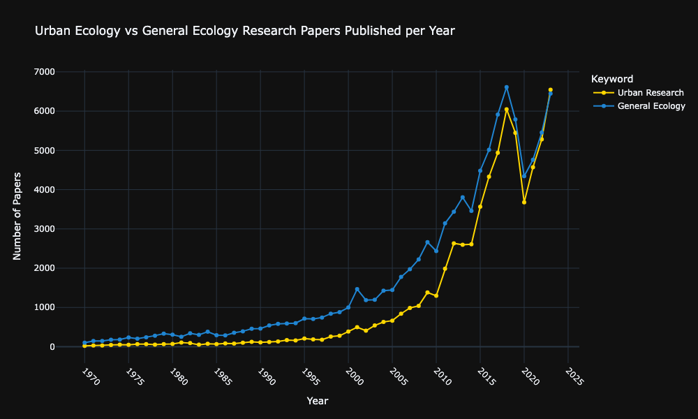
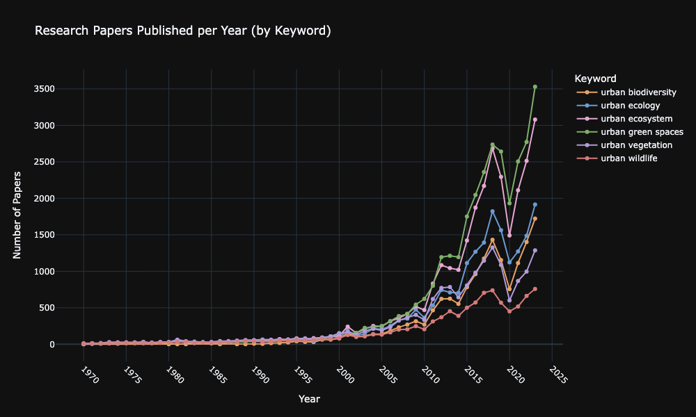
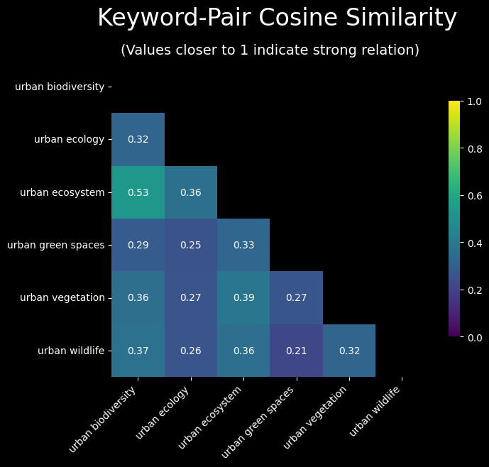
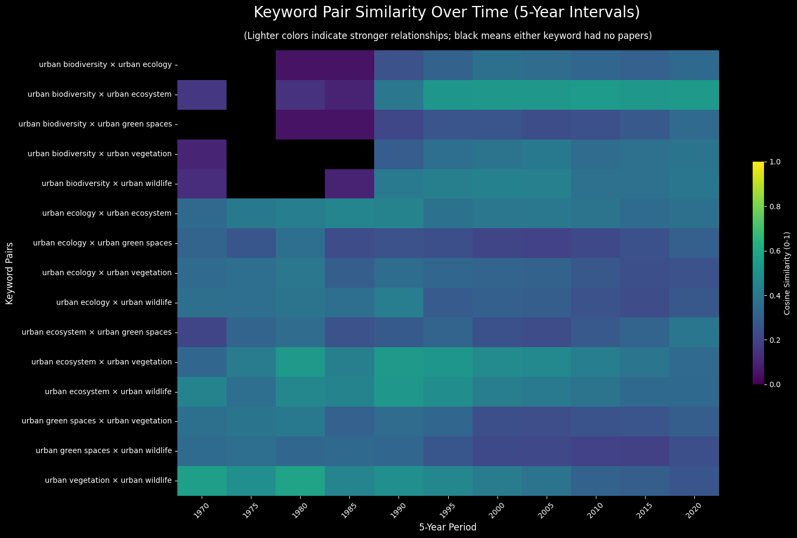
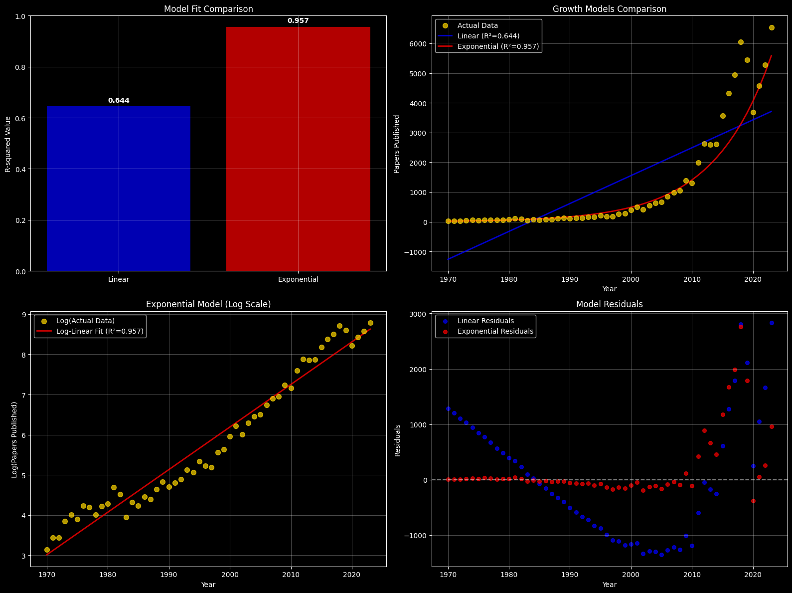
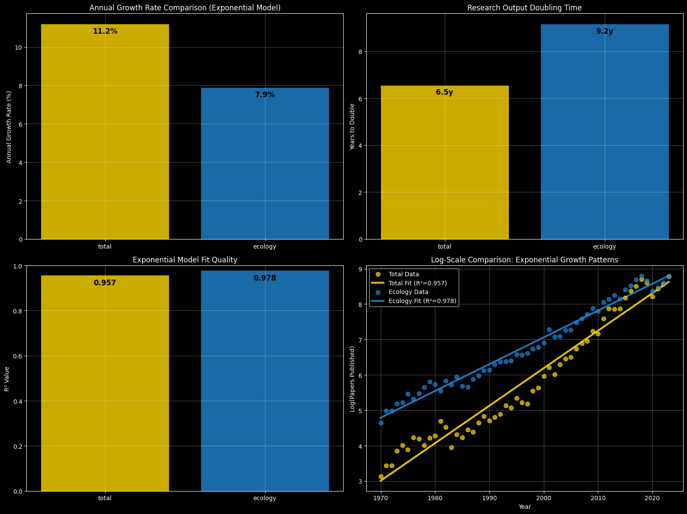
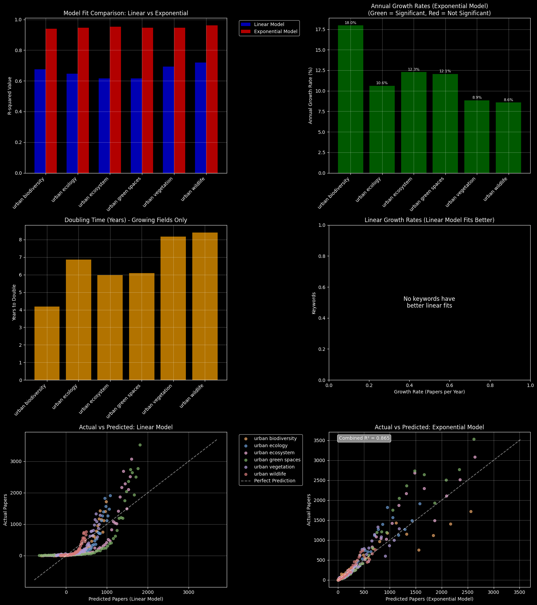
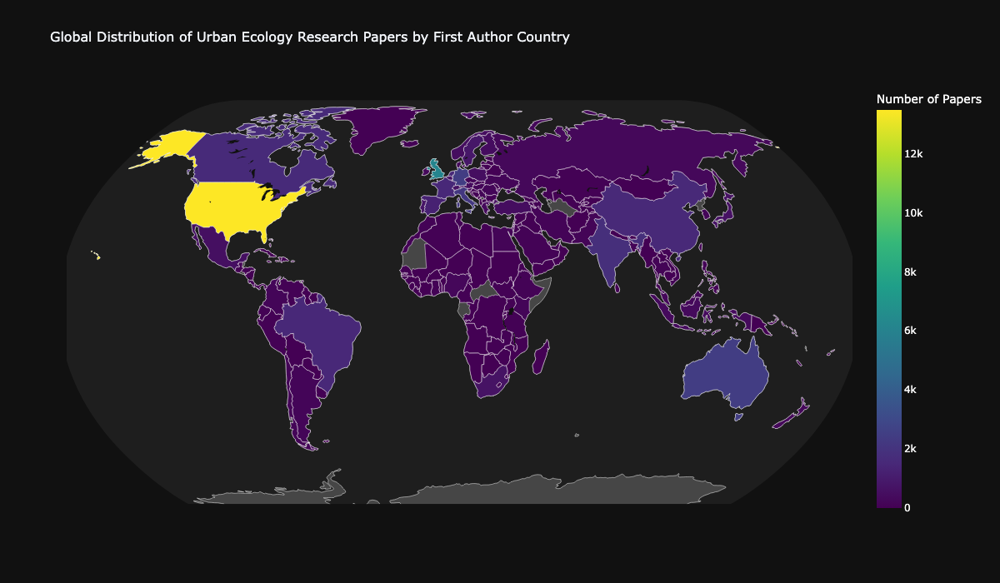
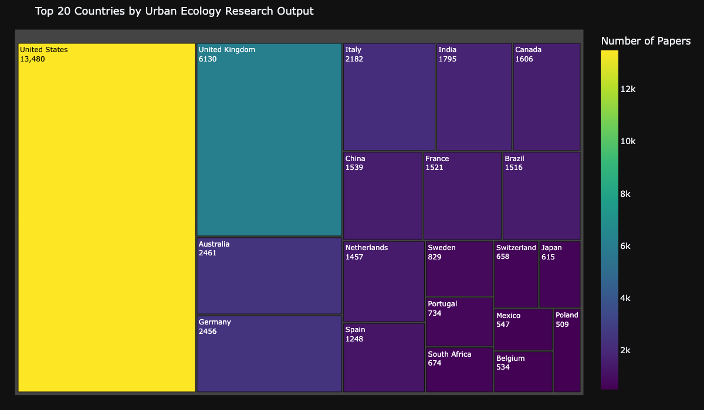
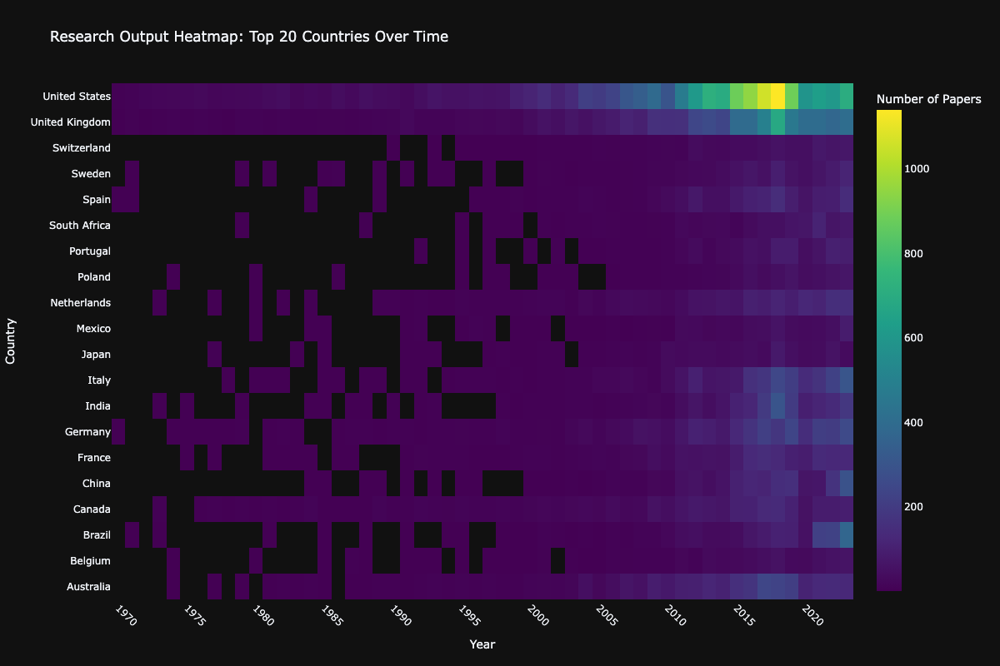

# Urban Ecology Research Trends

Analyzing keyword trends, publication growth, and thematic similarity in urban ecology literature.

For the interactive Dashboard, visit this [Stramlit.io link](https://urbanecologyresearchtrend.streamlit.app/)

(A presentation of my findings, without code, can be seen below)

## Project Goals

- Identify key research topics in urban ecology
- Measure co-occurrence and thematic similarity
- Visualize trends across decades

## Tools

- Python (Pandas, Plotly, Seaborn, SciPy)
- API: Data obtained from OpenAlex and Research Organization Registry (ROR)

---

Database schema:
Papers table:

| Column           | Type    | Notes                    |
| ---------------- | ------- | ------------------------ |
| `paperId`        | TEXT    | Primary Key              |
| `title`          | TEXT    |                          |
| `year`           | INTEGER |                          |
| `authors`        | TEXT    | Comma-separated list of author IDs |
| `url`            | TEXT    |                          |
| `search_keyword` | TEXT    | Comma-separated list of keywords |
| `firstAuthorCountryIso` |  TEXT | alpha-2 ISO country code |
| `firstAuthorId`  | TEXT    | Foreign Key connects to Authors table |
| `journal`        | TEXT    |                                    |
| `citationCount`  | INTEGER |                          |

Authors table:

| Column          | Type | Notes                             |
| --------------- | ---- | --------------------------------- |
| `authorId`      | TEXT | Primary Key                       |
| `name`          | TEXT |                                   |
| `last_known_institution_name` | TEXT |                     |
| `last_known_institution_ror` | TEXT | To obtain more geographical data from ROR |
| `country_code`  | TEXT |                                   |
| `country_name`  | TEXT |                                   |

# Research Trend Analysis

In this notebook I analysed the trend of scientific research performed within urban environments. I have chosen a few specific keywords related to Urban Ecology that I used to retrieve published papers using the OpenAlex API. I later enhanced my dataset by obtaining missing country data from the Research Organization Registry (ROR) to perform some geographical analysis.

**Note: I chose a date range starting in 1970 as that is the decade when the term Urban Ecology started getting traction. Data retrieval was cutoff in 2023 as there is still data missing from OpenAlex for the year 2024.

==============================================================
## Published Papers Time Series

We'll start with a simple analysis, looking at how many papers were published every year from 1970 to present day. 
First, we look at the full data, looking at the sum of every paper published across every keyword (the 'total' line in the graph below), then at the data per keyword. The graph below also has a 'control' dataset in the form of the 'ecology' keyword. That is, I compare the data related to research in urban environments to the scientific output on ecology as a whole.

We see a clear trend, where research volume quickly grows over the years. A curious data point happens around 2020, with a sharp drop in papers published, likely linked to the COVID pandemic, with numbers quickly picking up right after, following a similar slope as before.

That being said, the same trend can be observed for ecology as a whole. That is, scientific research is increasing in its totality, not only in urban environments. Although, looking at the latest data, urban research seems to be catching up, which could mean we might see just as many studies in cities as in more natural environments. Another possibility for that trend could be a result of the pandemic, where the scientific community started showing greater interest in urban environments post COVID, but that interest could decrease with time.

Although these are just guesses, and only with time we'll be able to confirm or refute either hypothesis.

While some keywords are clearly more popular than other, they all tend to follow a similar trend as the graph above. That said, it is interesting to see how Urban Ecosystems and Green Spaces exploded in the 2010s, producing as much papers as the other 4 keywords.

==============================================================
## Analyzing Keyword Relationship

Before anything else, I'll look into relationships between keywords, looking into whether they tend to appear together often. This should tell me if the choice of keywords was effective in covering a large portion of urban-related studies or if the overlap between any pair is too great, making them redundant.

Let's begin by analyzing the overall data, of all papers collected.

We can see the keywords have relatively low similarity, meaning they do occur together occasionally, but mostly cover their own fields. This means my choice of keywords was an effective one, as they indicate we were able to cover more ground, so to speak, in obtaining papers representative of studies performed within an urban context.

Next, I looked into temporal data, seeing how the relationships changed over time. Since initial data was sparse, which can cause some issues with the similarity calculation, I went with 5-year intervals. That is, I grouped all of the data every 5 years before I performed the relationship analysis.

A similar picture to our matrix above showed up here with the data over time. Relatioships didn't change much over time, with the one interesting case being the urban biodiversity X urban ecosystem case, which could mean a trend of shared research over time, though the value still isn't high enough to draw any conslusion.

===================================================================
## Regression Analysis on All Papers Published

Seeing the keywords don't overlap a lot, we can move on with other analyses.

We'll start by performing linear regression analysis on our data. We'll test to see if our data follows better linear or exponential growth. To do that, we'll do the regression analysis on the data as is, then on the data after performing a log transform (this serves to "flatten a curve" on data seeing exponential growth).

Results:
| Data | LINEAR MODEL | EXPONENTIAL MODEL |
| -----|--------------|-------------------|
| ` Annual Growth rate` | 93.87 new papers | 11.2% more papers |
| `R²` | 0.6442 | 0.9567 |
| `P-value` | 2.91e-13 | 4.04e-37 |

            =   =   =   =   =   =   =   =
KEY INSIGHTS - TOTAL URBAN ECOLOGY PAPERS GROWTH ANALYSIS:

- The field shows EXPONENTIAL growth with 11.2% annual growth rate
- Research output doubles every 6.5 years
- Exponential model explains 95.7% of variance
- High growth rate (11.2%/year) may not be sustainable long-term

### Urban Ecology vs General Ecology: Exponential Growth Comparison

Now let's compare urban ecology research growth against general ecology research to understand if urban environments are gaining research attention faster than the field as a whole.

Since the overlapped lines for yearly published papers showed similar curves, and the above analysis revealed the exponential growth model to be a better fit for urban ecology, we'll assume the same to be true for general ecology and go straight into only comparing both with an exponential model.

EXPONENTIAL GROWTH COMPARISON: URBAN ECOLOGY vs GENERAL ECOLOGY:

| Data | URBAN ECOLOGY | GENERAL ECOLOGY |
|------|---------------|-----------------|
| `Annual growth rate` | 11.2% | 7.9% | 
| `Doubling time` | 6.5 years | 9.2 years | 
| `R² (exponential fit)` | 0.9567 | 0.9777 | 
| `P-value` | 4.04e-37 | 1.20e-44 | 
| `Trend` | Significantly increasing | Significantly increasing |

                =   =   =   =   =   =   =   =
KEY COMPARATIVE INSIGHTS:

GROWTH RATES:
  ✓ Urban ecology is growing 3.3 percentage points FASTER

DOUBLING TIMES:
  ✓ Urban ecology doubles 2.6 years FASTER than general ecology

                =   =   =   =   =   =   =
RESEARCH IMPLICATIONS:

✓ Urban ecology is emerging as a high-growth research area
✓ Research focus is shifting toward urban environments
✓ Urban ecology may soon surpass general ecology in publication volume

### Per Keyword Regression Analysis

Now we'll move on to analysing each of the keywords, performing linear regression on both the regular data, then on a log-transformed data to see if any of the keywords might fit better a linear growth model.

============================================================================
## Geographical Data Analysis

In this next step, obtained geographical data to draw a choropleth map with the publication data. First, I filled in the gaps in OpenAlex's data by retrieving more country data from the Research Organization Registry (ROR).

As one could expect, the USA shows up on top, since they do have some of the largest research institutions in the world. To me, the surprising data comes from the UK, that manages to produce just under half the amount of papers while having less than a fourth of the population of the USA.

Other noteworthy datapoints to me are China and India, which I expected to have higher volume of publications by sheer number of their population. But perhaps, being emergent economies, scientific research wasn't really a thing until recently.

To look into that, let's create a heatmap with temporal data for the top 20 paper producing countries.

Indeed we can see that, while the USA and UK were scientifically active ever since urban ecology started gaining interest back in the 1970's, the rest of the world only started to look more ate the field much later. Of note, we see Italy, Germany, China, and Brazil starting to inch closer to the UK in production.

That's it. We looked briefly into the output of urban-related studies over the years and could see some interesting data from that. It indeed shows accelerated growth and more widespread interest, with potential to become more popular than general ecology in the future. However, that data is recent, so only time will tell if this trend will maintain in the future.
