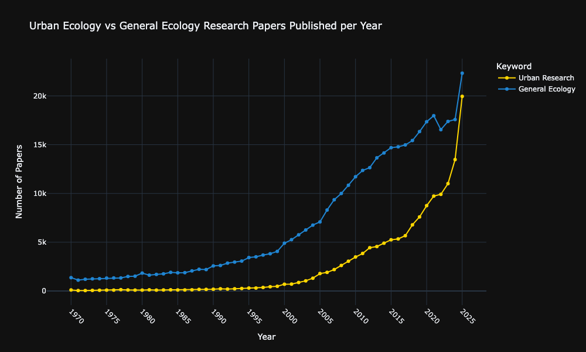
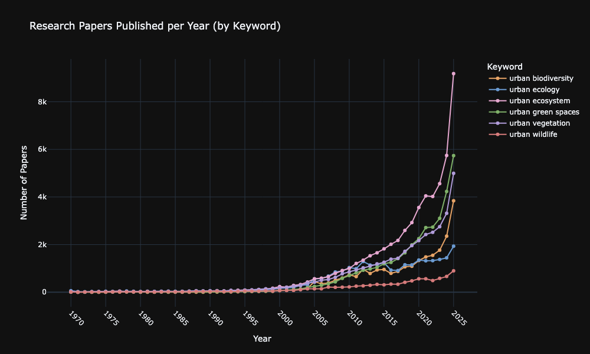
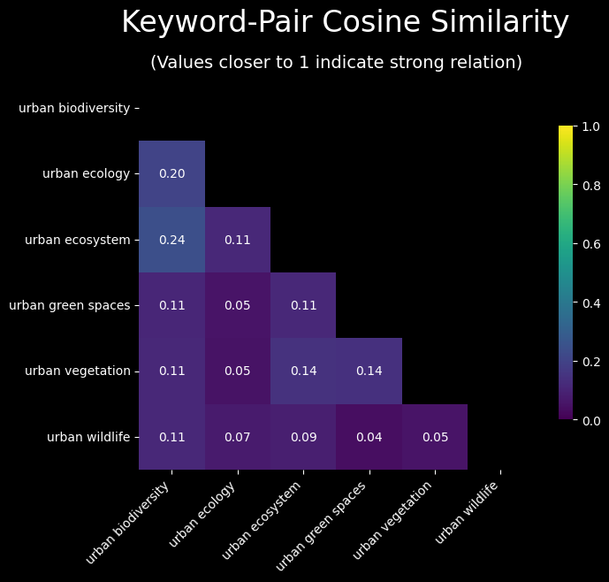
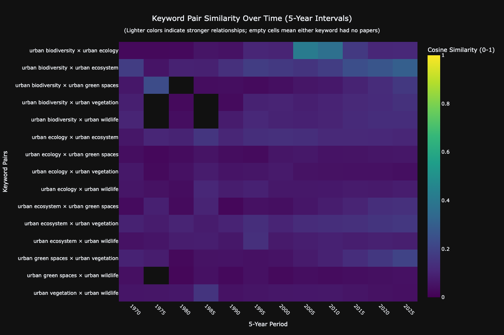
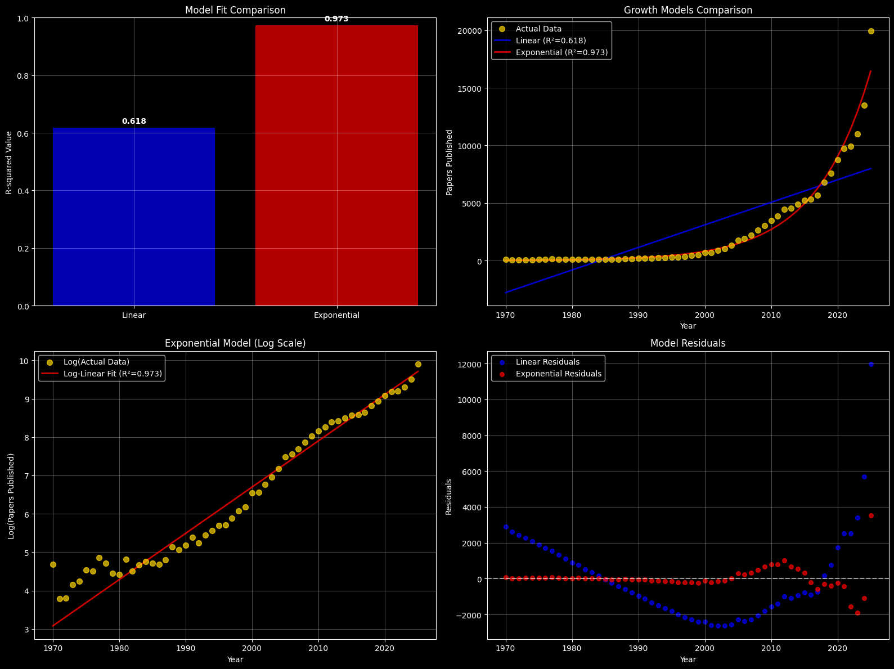
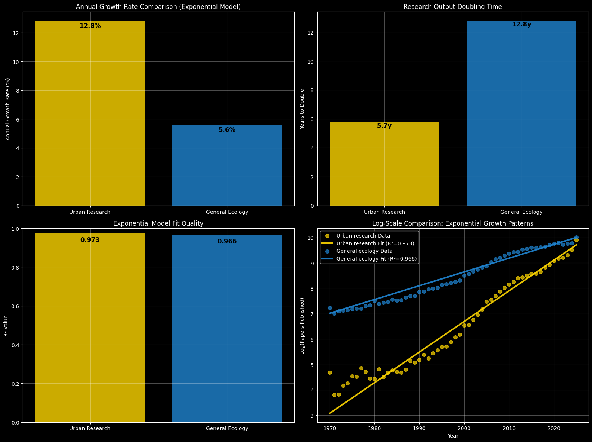
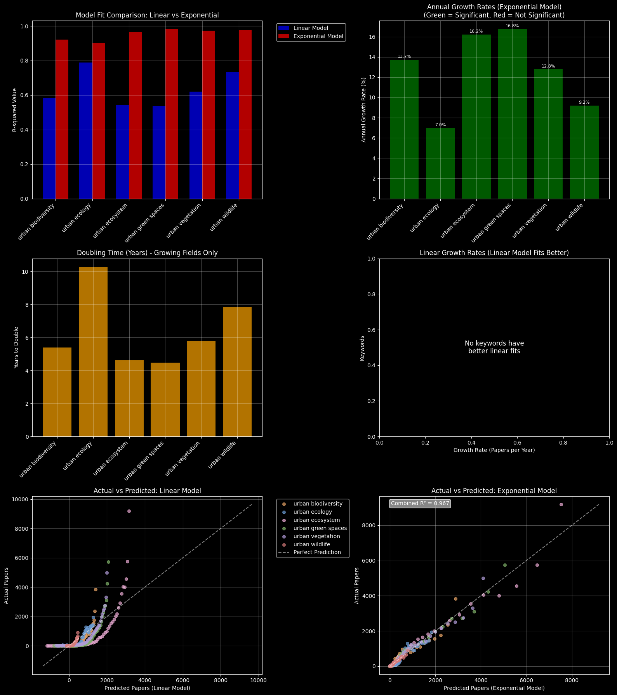
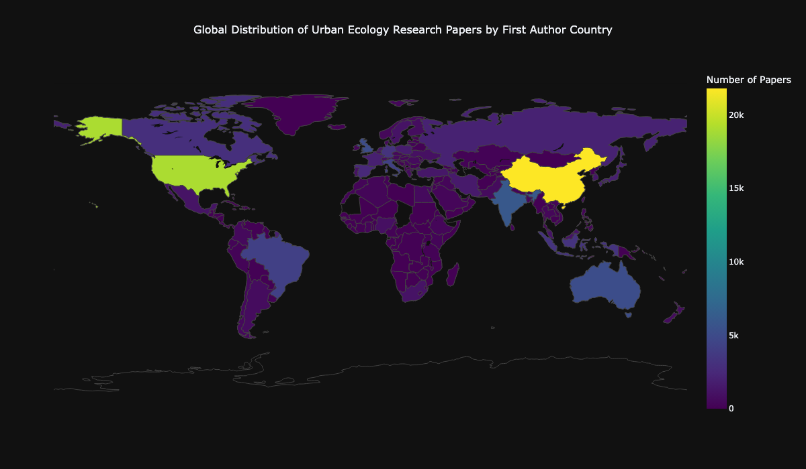
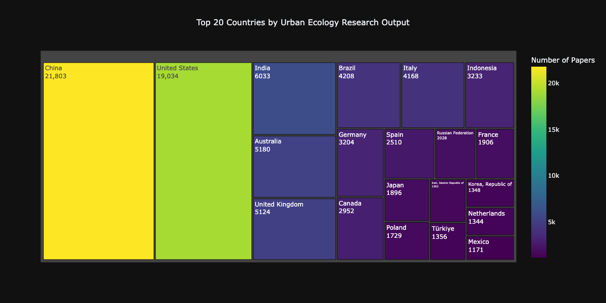
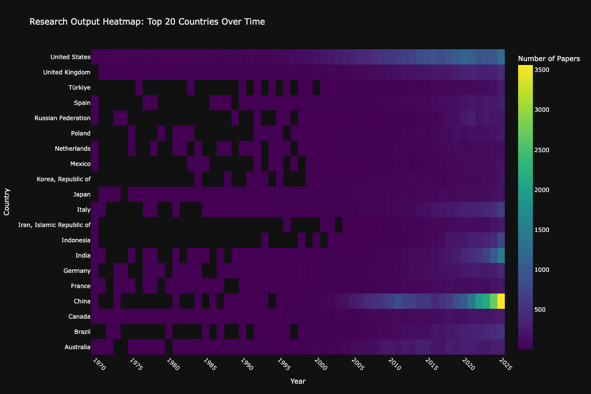

# Urban Ecology Research Trends

Analyzing keyword trends, publication growth, and thematic similarity in urban ecology literature.

For the interactive Dashboard, visit this [Stramlit.io link](https://urbanecologyresearchtrend.streamlit.app/)

(A presentation of my findings, without code, can be seen below)

## Project Goals

- Identify key research topics in urban ecology
- Measure co-occurrence and thematic similarity
- Visualize trends across decades

## Tools

- Python (Pandas, Plotly, Seaborn, SciPy)
- API: Data obtained from OpenAlex and Research Organization Registry (ROR)

---

Database schema:
Papers table:

| Column           | Type    | Notes                    |
| ---------------- | ------- | ------------------------ |
| `paperId`        | TEXT    | Primary Key              |
| `title`          | TEXT    |                          |
| `year`           | INTEGER |                          |
| `authors`        | TEXT    | Comma-separated list of author IDs |
| `url`            | TEXT    |                          |
| `search_keyword` | TEXT    | Comma-separated list of keywords |
| `firstAuthorCountryIso` |  TEXT | alpha-3 ISO country code |
| `firstAuthorId`  | TEXT    | Foreign Key connects to Authors table |
| `journal`        | TEXT    |                                    |
| `citationCount`  | INTEGER |                          |

Authors table:

| Column          | Type | Notes                             |
| --------------- | ---- | --------------------------------- |
| `authorId`      | TEXT | Primary Key                       |
| `name`          | TEXT |                                   |
| `last_known_institution_name` | TEXT |                     |
| `last_known_institution_ror` | TEXT | To obtain more geographical data from ROR |
| `country_code`  | TEXT |                                   |
| `country_name`  | TEXT |                                   |

# Research Trend Analysis

In this notebook I analysed the trend of scientific research performed within urban environments. I have chosen a few specific keywords related to Urban Ecology that I used to retrieve published papers using the OpenAlex API. I later enhanced my dataset by obtaining missing country data from the Research Organization Registry (ROR) to perform some geographical analysis.

**Note: I chose a date range starting in 1970 as that is the decade when the term Urban Ecology started getting traction. Data retrieval was cutoff in 2025 as it is the last full year of data.

==============================================================
## Published Papers Time Series

We'll start with a simple analysis, looking at how many papers were published every year from 1970 to present day. The graph below compares research made in an urban context (the 'Urban research' line), with production made across the rest of ecology ('General ecology' line). Later, we'll start looking at different areas of urban research, by leveraging a few specific keywords.

We see a clear trend, where research volume quickly grows over the years, and 'general ecology' historically a lot more research papers published. That gap shrunk greatly in the past few years, especially after 2023. One possible driver could have been the COVID pandemic, that could have brought attention to metropolitan settings.

That being said, this growth might not be sustainable long term, and perhaps general ecology might widen the gap again in the future.

Although these are just guesses, and only with time we'll be able to confirm or refute the hypothesis.

Now let's look at a breakdown in urban research. I chose a few popular keywords within the domain to get a good coverage of published papers, and avoiding too much overlap (I test this a little further)

While all keywords follow a similar trend, we see Urban Ecology and Urban Wildlife growing a lot slower than the other keywords. That makes sense, though, since cities are notorious for having very low animal diversity, and 'urban ecology' being the general field, might not be referenced by name as the other keywords.
The other interesting finding is the popularity of Urban Ecosystem over the others, with the gap widening even further after 2015.

==============================================================
## Analyzing Keyword Relationship

Before moving on, I'll look into relationships between keywords, analyzing whether they tend to appear together often. This should tell me if the choice of keywords was effective in covering a large portion of urban-related studies or if the overlap between any pair is too great, making them redundant.

Let's begin by analyzing the overall data, of all papers collected.

We can see the keywords have relatively low similarity, that is, they occur together only occasionally, meaning they mostly cover their own fields. This means my choice of keywords does indeed avoid too much overlap between papers

Next, I looked into temporal data, seeing how the relationships changed over time. Since initial data was sparse, which can cause some issues with the similarity calculation, I went with 5-year intervals. That is, I grouped all of the data every 5 years before I performed the relationship analysis.

A similar picture to our matrix above showed up here with the data over time. Relatioships didn't change much over time, but there are two interesting datapoints:
- We see urban ecology and biodiversity share over 40% of papers between 2005 and 2009, but then dropping down again after 2015.
- Urban biodiversity and Urban ecosystem seem to be slowly convergingm with similarity increasing over time until 2025.

===================================================================
## Regression Analysis on All Papers Published

Seeing the keywords don't overlap a lot, we can move on with other analyses.

We'll start by performing linear regression analysis on our data. We'll test to see if our data follows better linear or exponential growth. To do that, we'll do the regression analysis on the data as is, then on the data after performing a log transform (this serves to "flatten a curve" on data seeing exponential growth).

Results:
| Data | LINEAR MODEL | EXPONENTIAL MODEL |
| -----|--------------|-------------------|
| ` Annual Growth rate` | 195.83 new papers | 12.8% more papers |
| `R²` | 0.6183 | 0.9725 |
| `P-value` | 6.91e-13 | 2.88e-32 |

            =   =   =   =   =   =   =   =
KEY INSIGHTS - TOTAL URBAN ECOLOGY PAPERS GROWTH ANALYSIS:

- The field shows EXPONENTIAL growth with 12.8% annual growth rate
- Research output doubles every 5.7 years
- Exponential model explains 97.3% of variance
- High growth rate may not be sustainable long-term

### Urban Ecology vs General Ecology: Exponential Growth Comparison

Now let's compare urban ecology research growth against general ecology research to understand if urban environments are gaining research attention faster than the field as a whole.

Since the overlapped lines for yearly published papers showed similar curves, and the above analysis revealed the exponential growth model to be a better fit for urban ecology, we'll assume the same to be true for general ecology and go straight into only comparing both with an exponential model.

EXPONENTIAL GROWTH COMPARISON: URBAN ECOLOGY vs GENERAL ECOLOGY:

| Data | URBAN ECOLOGY | GENERAL ECOLOGY |
|------|---------------|-----------------|
| `Annual growth rate` | 12.8% | 5.6% | 
| `Doubling time` | 5.7 years | 12.8 years | 
| `R² (exponential fit)` | 0.9567 | 0.9777 | 
| `P-value` | 2.88e-32 | 1.64e-34 | 
| `Trend` | Significantly increasing | Significantly increasing |

                =   =   =   =   =   =   =   =
KEY COMPARATIVE INSIGHTS:

GROWTH RATES:
  ✓ Urban ecology is growing 7.2 percentage points FASTER

DOUBLING TIMES:
  ✓ Urban ecology doubles 7 years FASTER than general ecology

                =   =   =   =   =   =   =
RESEARCH IMPLICATIONS:

✓ Urban ecology is emerging as a high-growth research area
✓ Research focus is shifting toward urban environments
✓ Urban ecology may soon surpass general ecology in publication volume

### Per Keyword Regression Analysis

Now we'll move on to analysing each of the keywords, performing linear regression on both the regular data, then on a log-transformed data to see if any of the keywords might fit better a linear growth model.

We see all keywords also follow exponential growth, though some are clearly more frequent than others, with urban ecosystems and urban green spaces both following an annual growth rate of over 15%. Though, as stated above, this rate might be a reflection of a poplarity boost from the pandemic, and might come down a bit in the future. The data needs to be revisited in some years to see how the trend continues.

============================================================================
## Geographical Data Analysis

In this next step, obtained geographical data to draw a choropleth map with the publication data. First, I filled in the gaps in OpenAlex's data by retrieving more country data from the Research Organization Registry (ROR).

The two top producers of research aren't actually too surprising. China can output a lot merely by size alone, but as we'll see below, there seems to have been an increase in interest, and possibly funding in recent years. Meanwhile, the USA has some of the largest research institutions in the world, so not surprising it showd up at the top either. To me, the surprising data comes from India, which is also massive, but produces less than a third of the papers, maybe due to low funding for scientific research in some areas.

Moving on, I generated a heatmap of the top 20 countries to visualize how their research output changed over time.

Indeed we can see that, while the USA were scientifically active ever since urban ecology started gaining interest back in the 1970's, the rest of the world only started to look more at the field a bit later. Of note, we see what I mentioned above regarding China: the boom is relatively recent, having surpassed the USA in the 2010s. This also shows India might be starting to be more interested in the field, and could become a major player in the future.

That's it. We looked briefly into the output of urban-related studies over the years and could see some interesting data from that. It indeed shows accelerated growth and more widespread interest, with potential to become more popular than general ecology in the future. However, that data is recent, so only time will tell if this trend will maintain in the future.
